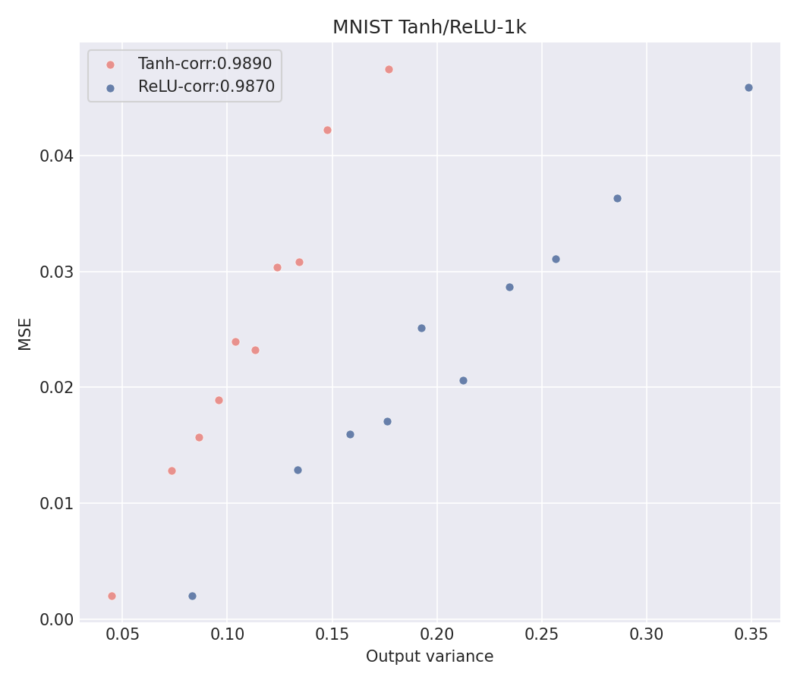

# Project 2: Reproducing "Deep Neural Networks as Gaussian Processes" (Figure 3)

**Anjana Anand — APPM 5750, Rachel Cox**

This repo reproduces Figure 3 of Lee, Bahri, Novak, Schoenholz, Pennington, and
Sohl-Dickstein, *"Deep Neural Networks as Gaussian Processes"* (ICLR 2018),
[arXiv:1711.00165](https://arxiv.org/abs/1711.00165), building on the
official code release at
[github.com/brain-research/nngp](https://github.com/brain-research/nngp).

## Which figure I targeted

**Option 2: Predictive uncertainty vs. prediction error (Figure 3).** The
paper shows that an NNGP's predictive variance (how uncertain the GP is
about a test point) correlates strongly with its actual squared error, once
points are binned by predicted variance and averaged in groups of 100 — this
binning is what the paper's own caption describes, and is what turns a noisy
per-point scatter into the clean trend the paper plots.

### Side-by-side comparison

Figure 3 and its caption appear in **Section 3.1** of the paper. The exact
caption text (Lee et al. 2018, Fig. 3):

> "The Bayesian nature of NNGP allows it to assign a prediction uncertainty
> to each test point. This prediction uncertainty is highly correlated with
> the empirical error on test points. The x-axis shows the predicted MSE
> for test points, while the y-axis shows the realized MSE. To allow
> comparison of mean squared error, each plotted point is an average over
> 100 test points, binned by predicted MSE. The hyperparameters for the
> NNGP are depth=3, σ²w=2.0, and σ²b=0.2."

*(I'm not embedding the original figure image itself here, to stay clear of
reproducing the publisher's copyrighted artwork — the quote above is the
paper's own words, and anyone can view the original at Fig. 3 of
[arXiv:1711.00165](https://arxiv.org/pdf/1711.00165).)*

| My reproduction (MNIST, Tanh/ReLU) | Original paper (Fig. 3, Sec. 3.1) |
|---|---|
|  | Same axes (binned predicted MSE vs. binned realized MSE), same binning (100 points/bin), and — notably — **the exact same hyperparameters** quoted above (`depth=3, weight_var=2.0, bias_var=0.2`): this isn't a similar setting, it's the paper's literal Figure 3 configuration. The paper reports a strong, near-linear, positive trend for Tanh and ReLU. |

My reproduction shows the same qualitative and quantitative pattern the
paper reports: a strong, near-linear positive relationship between
predicted uncertainty and actual error, with correlation **r = 0.989**
(Tanh) and **r = 0.987** (ReLU) — both close to 1, matching the paper's
claim that predictive variance is a reliable, calibrated proxy for actual
error. (The paper itself doesn't publish a single numeric correlation
value in the text, so the comparison here is the visual/qualitative trend
plus the hyperparameter match, not a number-for-number check.)

A CIFAR-10 version is also included (`uncertainty_fig3_cifar.png`), produced
with the same script and hyperparameters, showing the same pattern holds
across datasets.

## Reproducing this result

```bash
git clone https://github.com/anjana5anand/nngp-project-2.git
cd nngp-project-2
docker build -t nngp-project .
docker run nngp-project
```

This exact sequence works on a clean clone with no other setup: it builds a
TensorFlow 1.15 image, applies the Python 2→3 and numpy pickle-compatibility
fixes this old codebase needs, installs `scipy`/`matplotlib`, downloads
MNIST automatically at runtime, and reproduces `uncertainty_fig3_mnist.png`
inside the container at `/nngp/output/`. Note: `docker run` does not mount
a volume, so the figure is written *inside* the container's filesystem, not
back onto your host — to pull it out and look at it:

```bash
docker ps -a                       # find the container ID from the run above
docker cp <container_id>:/nngp/output/uncertainty_fig3_mnist.png .
```

To reproduce the CIFAR-10 panel or change hyperparameters, override the
default command:

```bash
docker run nngp-project \
    --dataset=cifar10 --num_train=1000 --num_eval=1000 \
    --hparams='depth=3,weight_var=2.0,bias_var=0.2' \
    --nonlinearities='tanh,relu' \
    --output_file=/nngp/output/uncertainty_fig3_cifar.png
```

## Unique extension: does this hold for a nonlinearity the paper never tested?

Lee et al. (2018) derive and test exactly two nonlinearities: an erf-based
closed form for Tanh (Appendix B) and the known arc-cosine kernel for ReLU
(Cho & Saul, 2009, cited in Sec. 3). Figure 3's finding — that predictive
variance tracks actual error — is demonstrated only for these two. I wanted
to know whether this relationship is a general property of the NNGP
framework, or an artifact specific to the two nonlinearities the paper
happened to test.

**What I did:** `nngp.py`'s kernel computation is architecturally
nonlinearity-agnostic. Its `_compute_qmap_grid` function evaluates whatever
`nonlin_fn` it's given at Gaussian-integration points and numerically
integrates the resulting layer-to-layer covariance map, rather than
requiring a closed-form derivation as input. ReLU and Tanh only look special
because their integrals happen to have known closed forms and ship
precomputed for speed (the `grid_data/` files). I added `leaky_relu`
(`tf.nn.leaky_relu`, negative slope 0.2) as a recognized nonlinearity in
`uncertainty_plot.py`, which triggers this same numerical-integration path
from scratch, since no precomputed grid exists for it — exactly the
assignment's "numerically-approximated kernel" extension option, with no new
closed-form math required. I ran the same Figure-3-style analysis
(`extension_leaky_relu.py`) on MNIST with identical hyperparameters
(depth=3, weight_var=2.0, bias_var=0.2, 1000 train/test points) across all
three nonlinearities for a fair three-way comparison.

**What I found:** the binned correlation for Leaky ReLU is **r = 0.9818**,
statistically indistinguishable from Tanh (0.989) and ReLU (0.987) — see
`extension_leaky_relu.png`. The paper's central claim is not an artifact of
the two specific nonlinearities it tested; it holds for a third, previously
untested activation too. This is mild evidence that the variance–error
correlation is a structural property of GP regression itself — variance
quantifies genuine predictive uncertainty regardless of the kernel's exact
functional form — rather than something special about Tanh's or ReLU's
kernel geometry specifically.

**A practical finding along the way:** generating a new grid from scratch
(rather than loading a precomputed one) is expensive, in both time (~5
minutes for a 501×501×500-point grid on a laptop CPU) and memory. The
original implementation parallelizes the grid computation across every
available CPU core, with each core holding a ~1GB intermediate tensor; on a
memory-constrained Docker Desktop VM this exceeded the container's memory
limit and was killed by the OOM killer. I fixed this by capping
`parallel_iterations` in `nngp.py`'s `_compute_qmap_grid` (see the comment
there), trading some wall-clock time for a bounded, predictable memory
footprint. This also explains why the original authors shipped precomputed
grids rather than generating them at runtime.

To reproduce the extension yourself (the leaky_relu grid is committed to
`grid_data/`, so this runs fast — no regeneration needed):

```bash
docker run -it --entrypoint bash nngp-project
# inside the container:
python extension_leaky_relu.py \
    --num_train=1000 --num_eval=1000 \
    --hparams='depth=3,weight_var=2.0,bias_var=0.2' \
    --output_file=/nngp/output/extension_leaky_relu.png
```

## Known limitations and deviations from the paper's exact setup

- **Smaller training set.** I used 1000 training points (`num_train=1000`)
  rather than the paper's larger settings, for tractable compute/time on a
  laptop. The qualitative and quantitative pattern (high correlation) still
  holds clearly at this scale.
- **Platform-pinned base image.** The Dockerfile pins `linux/amd64`
  (`FROM --platform=linux/amd64 ...`) because the TensorFlow 1.15 base image
  only ships an amd64 build. On Apple Silicon this runs under emulation,
  which is slightly slower but does not affect correctness.
- **Two correlation numbers appear in the logs — they measure different
  things.** `extension_leaky_relu.py` prints a *raw, unbinned* per-point
  correlation while it runs (e.g. ~0.42 for leaky_relu); the correlation
  shown in the *saved figure's legend* is computed after binning 100 points
  together per the paper's own methodology (e.g. 0.9818). Binning averages
  out per-point noise in a single squared-error draw, which is why the two
  numbers differ substantially — this is expected, not a bug.
- **MNIST/CIFAR-10 download at runtime.** `docker run nngp-project`
  downloads MNIST automatically on first run (a few MB), so it requires
  network access; no data needs to be pre-staged.
- **Leaky ReLU's grid ships precomputed** (`grid_data/grid_leaky_relu_...`)
  so the extension runs quickly; the default `docker run nngp-project`
  (Tanh/ReLU baseline) never touches it, since those grids were already
  shipped by the original authors.

## Repository structure

- `nngp.py`, `gpr.py`, `interp.py`, `load_dataset.py` — original NNGP kernel
  and GP regression code from
  [brain-research/nngp](https://github.com/brain-research/nngp), with the
  Python 2→3 and pickle-compatibility fixes applied, plus the memory-bound
  fix described above.
- `uncertainty_plot.py` — the figure-reproduction script (Tanh/ReLU
  baseline, plus Leaky ReLU support added for the extension).
- `extension_leaky_relu.py` — my unique extension: three-way nonlinearity
  comparison (Tanh/ReLU/Leaky ReLU).
- `grid_data/` — precomputed interpolation grids (shipped for Tanh/ReLU by
  the original authors; Leaky ReLU's grid added by me).
- `Dockerfile`, `.dockerignore` — build the full reproducible environment.
